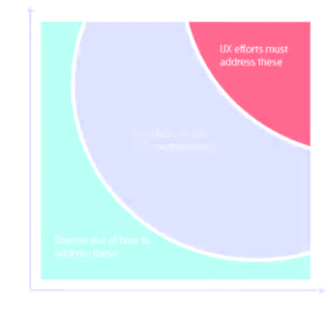
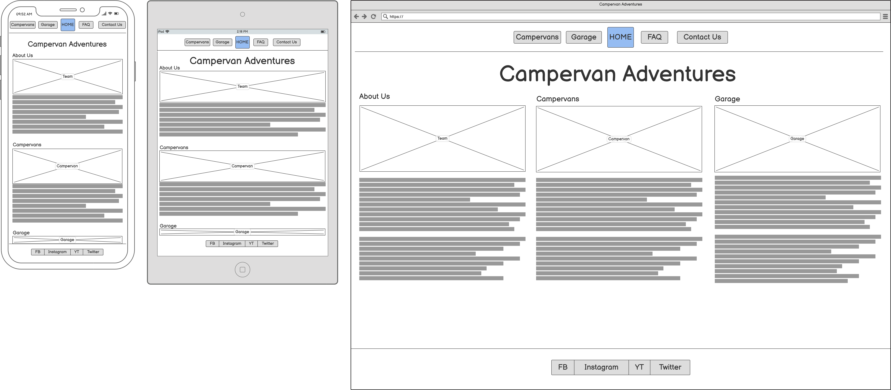
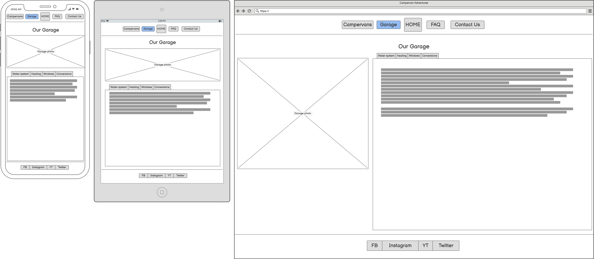
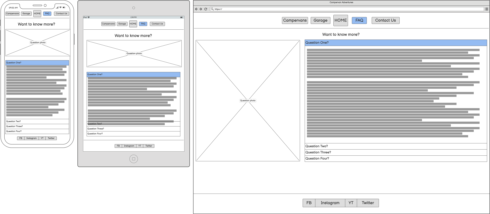
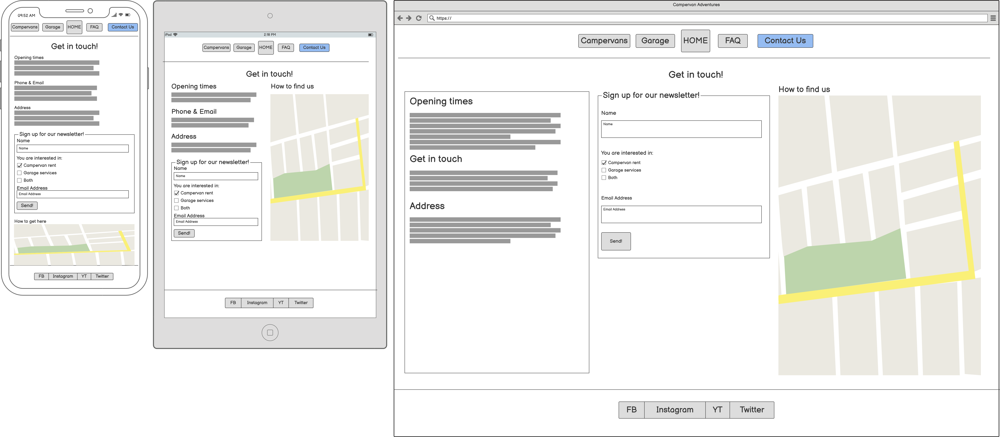

# Campervan Adventures

This webpage is the showcase for a company Campervan Adventures with the intention to encourage anyone considering having a holiday in a campervan to contact them and rent one of their vehicles. Campervan Adventures aims to achieve this goal through giving the visitor the taste of how much fun and beauty holidays in a campervan can provide and showing some of their campervans in the Our Campervans section.

Live project can be seen here: (link).

# User Experience (UX)

**Project preparation**

The Campervan Adventures site was designed using the Five Planes of User Experience approach. Below are represented the steps taken during the preparation of the site, going from the most abstract to the most concrete.

1. Strategy

**Goals**

In preparing the project the following goals were taken into account:

*Owner’s goals*

The webpage owner’s goal is to create online presence for Campervan Adventures in order to increase their rental turnover via visitors’ engagement and customer loyalty. 

*User's goals*

When preparing the webpage I considered User's goals through the following User stories:

*First Time Visitor's goals:*

* As a First Time Visitor I want to see what holidays in a campervan look and feel like so that I can decide whether it's appealing to me. **End user goal:** Decide on my  attitude to campervan holidays. **End business goal:** Build prospective customer engagement. **Acceptance criteria:** Present available campervans in an appealing manner. <!--**Measurement of success:** (Measurement of success is the way in which we will prove the story was successful in meeting the user and business goal defined above. This will initially be left blank and will be determined through conversations with research, ux and product. This must be finalized before dev starts.) -->

*First Time or Returning Visitor Goals:*

* As a Visitor I want to contact Campervan Adventures to enquire about vehicle rental. **End user goal:** Contact the company. **End business goal:** Achieve direct contact with customer to provide service. **Acceptance criteria:** Provide means of contact via telephone, email and visit to the physical address. 
* As a Visitor I want to subscribe to email newsletter. **End user goal:** Stay in contact for further information and inspiration. **End business goal:** Build and maintain customer loyalty through customer engagement. **Acceptance criteria:** Obtain customer contact information via email and optionally telephone number. 
* As a  Visitor I want to check  what is needed to have a holiday in a campervan. **End user goal:** Obtain details on what is needed before and during campervan holiday. **End business goal:** Provide customer with clarity about their engagement necesary for satisfying campervan holiday. **Acceptance criteria:** Inform customer about necessities and sugestions related with rental: legal, practical, attitude.
* As a Visitor I want to see what vehicles are on offer and check for current promotions. **End user goal:** Choose a vehicle. **End business goal:** Provide customer with choice of product leading to rental completion. **Acceptance criteria:** Show pictures and description of vehicles available for rent. 
* As a Visitor I want to rent a vehicle online. **End user goal:** Finalize rental contract. **End business goal:** Finalize sale of service. **Acceptance criteria:** Update company vehicle database on vehicle availability. Finalize contract and sale via debit/credit card. Receive payment. Provide confirmation on rental and payment.

**Focus / What is worth doing?**

With Owner’s goals in mind and Users’ goals and scenarios taken into consideration the following opportunities were assessed at the initial roll-out:

| No. | Opportunity / problem                                                | Importance (1 - 5 most important) | Viability / Feasibility (1– 5 most feasible) | Focus ratio |
| --- | -------------------------------------------------------------------- | ------------------------------------ | -------------------------------------------- | ----------- |
| 1   | Create positive image of campervan holidays and Campervan Adventures | 5                                    | 5                                            | 100%        |
| 2   | Ability to contact the company                                       | 5                                    | 5                                            | 100%        |
| 3   | Signing up to the newsletter                                         | 4                                    | 5                                            | 78%         |
| 4   | View company’s offer                                                 | 5                                    | 4                                            | 78%         |
| 5   | Presenting company's services                    | 3                                    | 4                                            | 43%         |
| 6   | Rent online                                                          | 4                                    | 1                                            | 9%          |

I calculated the Focus ratio by multiplying Importance and Viability and normalised the results. This enabled me to compare every Opportunity on a scale of 0-100%. The higher the number the more crucial it is for the Opportunity to be addressed. Importance and Feasibility spectrum is perfectly illustrated on Code Institute graph below; Opportunities with high factor of both importance and viability would find themselves on the top right corner of the graph. 

Basing on the above analysis the initial roll-out follows on opportunities 1 through 4 as most important and feasible and as such are addressed in the project. 

**Definition**

The webpage is an online presence for Campervan Adventures showcasing the attractiveness of campervan holidays and encouraging visitors to contact the company.

**Value**

The value of the project for the owner lies in increased rental turnover achieved through enhanced visitor’s engagement and deepened customer loyalty resulting in repeat orders.
The value for the visitor lies in getting familiar with the world of campervan holidays and getting an opportunity to realize this vision. 

2. Scope

**Objective requirements**

Visitor wants to find out about spending holidays in a campervan with the possibility of realising this idea.

**Functional specifications**

Visitor uses site navigation to find the information presented on the webpage. To sign up for a newsletter the visitor needs to enter their personal information. 

**Content requirements**

Webpage need to contain:
* Introduction and pictures representing holidays in a campervan
* Company’s offer with pictures of vehicles and their description
* Ability to contact the company via email, social media and telephone.
* Possibility to sign up to the newsletter
* Presenting company's services.

**Campervan Adventures project rollout**

|   | **Feature**                                                           | **Difficulty (1 – 3 most difficult)** | **Release** |
| - | --------------------------------------------------------------------- | ------------------------------------- | ----------- |
| 1 | Introduction and pictures representing holidays in a campervan        | 1                                     | 1           |
| 2 | Company’s offer with pictures of vehicles and their description       | 2                                     | 1           |
| 3 | Ability to contact the company via email, social media and telephone. | 1                                     | 1           |
| 4 | Possibility to sign up to the newsletter                              | 1                                     | 1           |
| 5 | Presenting company's services                     | 2                                     | 2           |
| 6 | Online rental                                                         | 3                                     | 2           |

This rollout concentrates on features bringing maximum value to the owner and the user. Those have been identified as features 1 through to 5.

Feature No. 6 enabling visitors to rent vehicles online finds itself outside the initial rollout due to necessity of employing technologies not included in the project. 

3. Structure

The information is prioritised in the following order:
*	Presentation of the holidays in a campervan
*	Company offer
*	Contact section
*	Possibility to sign up for the newsletter.

Webpage has three main semantic sections: 

*	**Navigation bar** at the top of the page is conveniently available to the user at all times and contains links to: Home page, Our Campervans and Contact Us which show in the main section.

*	**Main section in the middle**

    * Landing page - shows a short welcome and description of the company (About Us) and it's offerings (Campervans and Garage).
    
    * Campervans - is the page presenting available campervans with photographs and description of each vehicle. In case more than one photograph is available for a campervan they will be changed by the mouse click using carousel. This part enables visitor to get the feeling which campervan they would be most comfortable in.

    * Garage - shows description of services offered at company's garage.

    * FAQ - presents answeres to frequently asked questions related to company's rental and campervan service business.

    * Contact Me - provides contact data (opening hours, address of the company, telephone number and an email address), Google map, newsletter sign-up section.

*	**Footer** with links to company’s social media at the bottom of every page. Links in the footer open in separate browser windows.

4. Skeleton

Site low-fidelity prototypes were created in three versions for various screen sizes: smartphone, tablet and Personal Computer to maintain website responsiveness on various screen sizes. For this purpose I used Balsamiq tool.  

**Home** page wireframes:

**Campervans** wireframes:

This page uses carousele component for rotation of images.  

**Garage** wireframes:

This page uses Tab Bar component to navigate among various services offered by the company's garage.

**FAQ** wireframes:

This page uses form for Acordion component for efficient usage of the web page space.

**Contact Us** wireframes:

This page uses form for collecting user's data and Google Maps for navigation.

5. Surface

The intention behind building the sensory design for the site is focusing on a simple message of beauty lying in campervan holiday. This is why the visitor will be welcomed with a topical pictures of a landscape with a campervan. Navigational elements in the header and footer will be placed on white background and will be using pallette inspired by the summer colours of blue sky and hay. The pallette is compiled using [Colormind](http://colormind.io/) webpage. 

Active element will be marked with a distinct colour to help visitor in navigation.

Company logo will always be visible in the navigation section and will lead to home page.

# Technologies used
This project has been realised using the following technologies:
* HTML5
* CSS3
* JavaScript (Bootstrap solutions for responsive navigation and carousel)

# Frameworks, Libraries and Programs used
This project has been realised using the following frameworks, programs and webpages:
* Git - for version control
* GitHub - for storing the project's code and other files
* Visual Studio Code - for writing the code and documents
* Balsamiq - for wireframes creation
* [Bootstrap](https://getbootstrap.com/) - for navigation and image manipulation components
* [Google Fonts](https://fonts.google.com/)
* [Canva](www.canva.com) – logo creation
* [Colormind](http://colormind.io) – color palette creation  
* [Unsplash](https://unsplash.com) - for stock photographs
* [Pikwizard](https://pikwizard.com/) - for stock photographs
* [Table to Markdown](https://tabletomarkdown.com) - for converting tables to markdown format.
* [Awkale GitHub repository](https://github.com/awkale/user-story-best-practice/blob/master/README.md) - User Story Best Practice documentation and presentation
* [W3 School](https://www.w3schools.com/)
* [C#Corner](https://www.c-sharpcorner.com/blogs/accordion-using-html-5) - for tutorial on HTML5-based accordion

# Deployment
The site will be deployed to GitHub pages, using also GitHub repository, GitHub clone and GitHub branch methods as needed. On local computer Visual Studio Code program was used.

Link to live site will be *here*. 

# Testing
*Validators*

The following validators will be used for testing code correctness:
* [W3C Markup Validator](https://validator.w3.org/) *links to results:*

[Main page](https://validator.w3.org/nu/?doc=https%3A%2F%2Fkarmiles.github.io%2Fcampervan-adventures%2F), 
* [W3C CSS Validator](https://jigsaw.w3.org/css-validator/) (*link to results will appear here*)

*User Experience (UX) testing*

* Goal 1: Optimal visibility and functionality on various devices will be tested using [Responsive Designs](http://ami.responsivedesign.is)
* Goal 2: Testing fo accesibility of the site [WAVE Web Accessibility Evaluation Tool](https://wave.webaim.org/)
* Goal 3: Performance testing [Lighthouse](https://developers.google.com/web/tools/lighthouse)
* Goal 4: Testing for user stories (screenshots of the finished product and explanation how the site meets the requirements of the user stories).
* Goal 5: Peer code review at Slack (#peer-code-review).

# Bugs and changes to original design
During realisation of the project the following obstacles were met and changes to original design introduced:
* Footer behaving differently on different pages. Fixed position was covering other content. On Campervans page when on static property footer was not spreading across width of page. Solution: default position on all pages. On Campervans page I added property clear with value both. 
* Order of content slightly changed for better visibility; map visible on all screen.
* Presentation of information changed on Garage page; as navigation bar component would be very similar to main navigation bar I decided on a different solution: devided content into slates, adhering to responsive design practice.

# Credits
* Code
* Media
* Acknowledgements