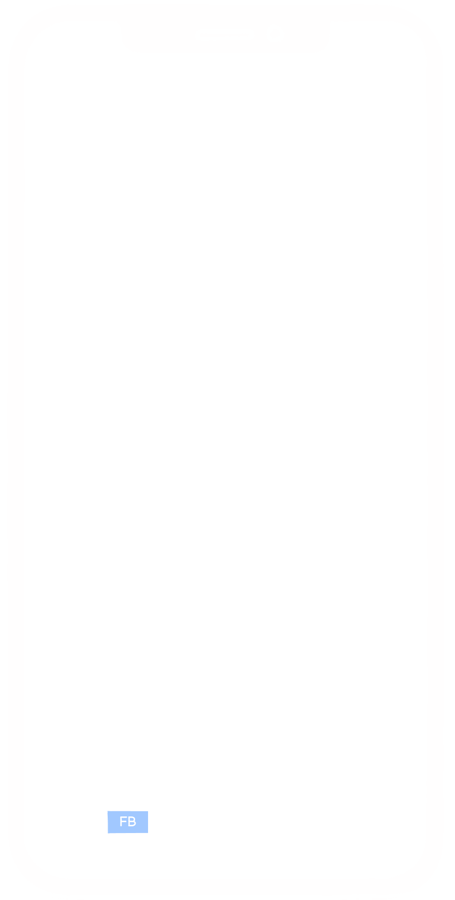
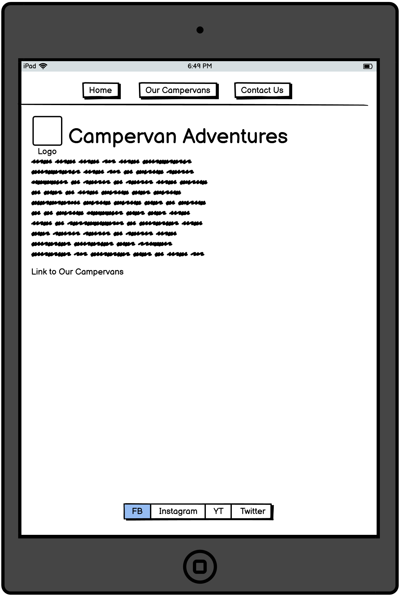
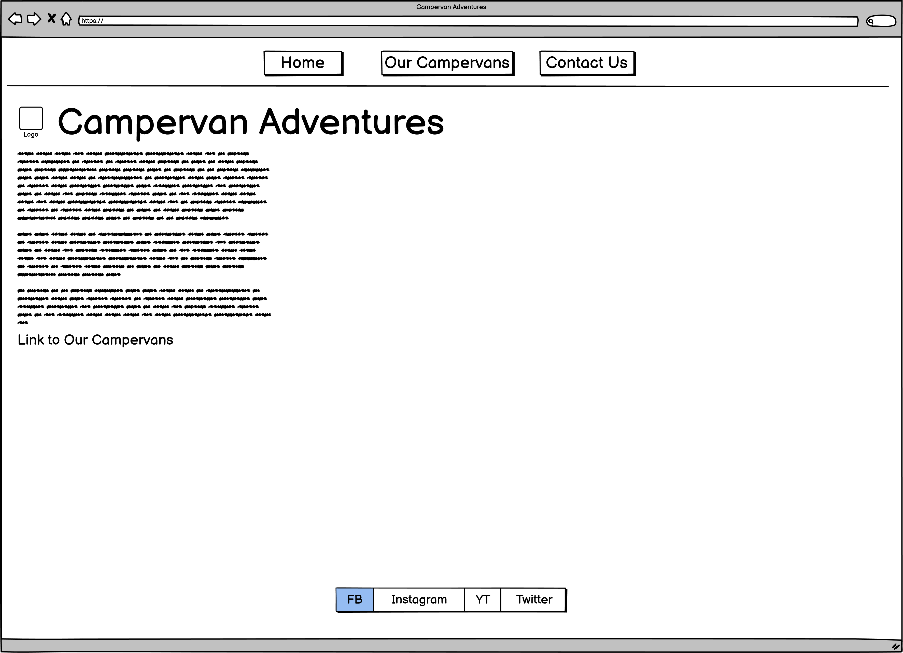
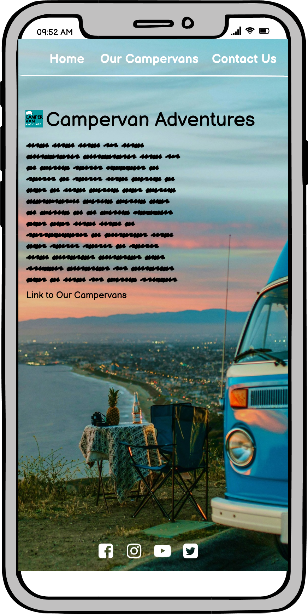
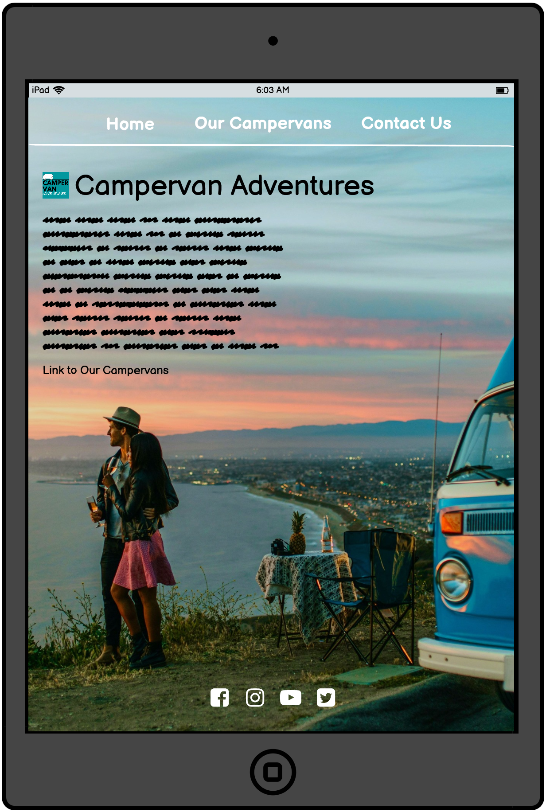

# Campervan Adventures

This webpage is the showcase for a company Campervan Adventures with the intention to encourage anyone considering having a holiday in a campervan to contact them and rent one of their vehicles. Campervan Adventures aims to achieve this goal through giving the visitor the taste of how much fun and beauty holidays in a campervan can provide and showing some of their campervans in the Our Campervans section.

Live project can be seen here: (link).

# User Experience (UX)

**Project preparation**

The Campervan Adventures site was designed using the Five Planes of User Experience approach. Below are represented the steps taken during the preparation of the site, going from the most abstract to the most concrete.

1. Strategy

**Goals**

In preparing the project the following goals were taken into account:

* Owner’s goals

The webpage owner’s goal is to create online presence for Campervan Adventures to increase their rental turnover via visitors’ engagement and customer loyalty. 

* User's goals

When preparing the webpage I considered the following User stories:

*First Time Visitor Goals:*

to see what holidays in a campervan look and feel like, to be able to contact Campervan Adventures in case of further questions or enquire about vehicle rental, to be able to subscribe to email newsletter and, possibly, rent a vehicle online.

*Returning Visitor Goals:*

to check further details about what is needed to have a holiday in a campervan and draw on support provided by Campervan Adventures and affiliate services.

*Frequent User Goals:*

to see what new vehicles are on offer and check for current promotions.

**Focus / What is worth doing?**

With Owner’s goals in mind and Users’ goals and scenarios taken into consideration the following opportunities were assessed at the initial roll-out:

| No. | Opportunity / problem                                                | Importance (1 - 5 most important) | Viability / Feasibility (1– 5 most feasible) | Focus ratio |
| --- | -------------------------------------------------------------------- | ------------------------------------ | -------------------------------------------- | ----------- |
| 1   | Create positive image of campervan holidays and Campervan Adventures | 5                                    | 5                                            | 100%        |
| 2   | Ability to contact the company                                       | 5                                    | 5                                            | 100%        |
| 3   | Signing up to the newsletter                                         | 4                                    | 5                                            | 78%         |
| 4   | View company’s offer                                                 | 5                                    | 4                                            | 78%         |
| 5   | Directing User to further inspiration and support                    | 3                                    | 4                                            | 43%         |
| 6   | Rent online                                                          | 4                                    | 1                                            | 9%          |

I calculated the Focus ratio by multiplying Importance and Viability and normalised the results. This enabled me to compare every Opportunity on a scale of 0-100%. The higher the number the more crucial it is for the Opportunity to be addressed. Importance and Feasibility spectrum is perfectly illustrated on Code Institute graph below; Opportunities with high factor of both importance and viability would find themselves on the top right corner of the graph. 

Basing on the above analysis the initial roll-out follows on opportunities 1 through 4 as most important and feasible and as such are addressed in the project. 

**Definition**

The webpage is an online presence for Campervan Adventures showcasing the attractiveness of campervan holidays and encouraging visitors to contact the company.

**Value**

The value of the project for the owner lies in increased rental turnover achieved through enhanced visitor’s engagement and deepened customer loyalty resulting in repeat orders.
The value for the visitor lies in getting familiar with the world of campervan holidays and getting an opportunity to realize this vision. 

2. Scope

**Objective requirements**

Visitor wants to find out about spending holidays in a campervan with the possibility of realising this idea.

**Functional specifications**

Visitor uses site navigation to find the information presented on the webpage. To sign up for a newsletter the visitor needs to enter their personal information. 

**Content requirements**

Webpage need to contain:
* Introduction and pictures representing holidays in a campervan
* Company’s offer with pictures of vehicles and their description
* Ability to contact the company via email, social media and telephone.
* Possibility to sign up to the newsletter
* Directing User to further inspiration and support.

**Campervan Adventures project rollout**

|   | **Feature**                                                           | **Difficulty (1 – 3 most difficult)** | **Release** |
| - | --------------------------------------------------------------------- | ------------------------------------- | ----------- |
| 1 | Introduction and pictures representing holidays in a campervan        | 1                                     | 1           |
| 2 | Company’s offer with pictures of vehicles and their description       | 2                                     | 1           |
| 3 | Ability to contact the company via email, social media and telephone. | 1                                     | 1           |
| 4 | Possibility to sign up to the newsletter                              | 1                                     | 1           |
| 5 | Directing User to further inspiration and support                     | 2                                     | 2           |
| 6 | Online rental                                                         | 3                                     | 2           |

This rollout concentrates on features bringing maximum value to the owner and the user. Those have been identified as features 1 through to 4.

Feature No. 6 enabling visitors to rent vehicles online finds itself outside the initial rollout due to necessity of employing technologies not included in the project. 

3. Structure

The information is prioritised in the following order:
*	Presentation of the holidays in a campervan
*	Company offer
*	Contact section
*	Possibility to sign up for the newsletter.

Webpage has three main semantic sections: 

*	**Navigation bar** at the top of the page is conveniently available to the user at all times and contains links to: Home page, Our Campervans and Contact Us which show in the main section.

*	**Main section in the middle**

    *	Landing / Home page - contains an image sending the user a clear message about the subject of the website and text with concise presentation of the value the company provides to their customers. The theme both on image and text is wonderful holidays in a campervan.

    *	Our Campervans - shows a short presentation of available campervans with photographs and description of each vehicle. This enables visitor to get the feeling which campervan they would be most comfortable in.

    *	Contact Me - provides address of the company, telephone number, email address and a possibility to sign up for a newsletter.

*	**Footer** with links to company’s social media at the bottom of every page. Links in the footer open in separate browser windows.

4. Skeleton

Site low-fidelity prototypes were created in three versions for various screen sizes: smartphone, tablet and Personal Computer to maintain website responsiveness on various screen sizes. For this purpose I used Balsamiq tool.  

**Home page**

Smartphone skeleton:

Tablet skeleton: 

Personal Computer skeleton:

5. Surface

The intention behind building the sensory design for the site is focusing on a simple message of beauty lying in campervan holiday. This is why the visitor will be welcome with a topical picture of a landscape with a campervan in the background covering whole page with text in black. For distinction navigational elements in the header and footer will be white. 

**Home page**

Below are examples of the Home page design made in Balsamiq tool.

Smartphone design:

Smartphone design:

Personal Computer design:

