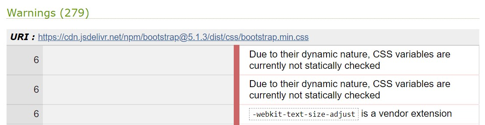
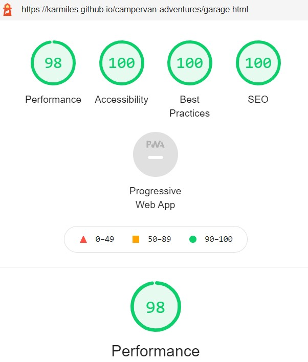

# Campervan Adventures

Developer: Karol Mileszko

This webpage is the showcase for a company Campervan Adventures with the intention to encourage anyone considering having a holiday in a campervan to contact them and rent one of their vehicles. Campervan Adventures aims to achieve this goal through giving the visitor the taste of how much fun and beauty holidays in a campervan can provide and showing some of their campervans in the Our Campervans section.

[Life webpage](https://karmiles.github.io/campervan-adventures/index.html)

**Project preparation**

The Campervan Adventures site was designed using the Five Planes of User Experience approach. Below are represented the steps taken during the preparation of the site, going from the most abstract to the most concrete.
# Plane 1. Strategy

## Project Goals
### Owner’s goals

- Create online presence for Campervan Adventures in order to increase their rental turnover via visitors’ engagement and customer loyalty. 
- Provide customers with means necessary to contact the company.

### Users' goals
- See how holiday in a campervan can be appealing.
- Contact the company about rental.
- Get more information and inspiration to follow on.
- Check what is needed for campervan holiday.
- See what vehicles are available.
- Rent a vehicle.

## User Experience (UX)

### User stories:

First Time Visitor's goals:

1. As a First Time Visitor I want to see what holidays in a campervan look and feel like so that I can decide whether it's appealing to me. **End user goal:** Decide on my  attitude to campervan holidays. **End business goal:** Build prospective customer engagement. **Acceptance criteria:** Present available campervans in an appealing manner. Provide clarification on common questions.

First Time or Returning Visitor Goals:

2. As a Visitor I want to contact Campervan Adventures to enquire about vehicle rental. **End user goal:** Contact the company. **End business goal:** Achieve direct contact with customer to provide service. **Acceptance criteria:** Provide means of contact via telephone, email and visit to the physical address. 
3. As a Visitor I want to subscribe to email newsletter. **End user goal:** Stay in contact for further information and inspiration. **End business goal:** Build and maintain customer loyalty through customer engagement. **Acceptance criteria:** Obtain customer contact information via email and optionally telephone number. 
4. As a  Visitor I want to check  what is needed to have a holiday in a campervan. **End user goal:** Obtain details on what is needed before and during campervan holiday. **End business goal:** Provide customer with clarity about their engagement necesary for satisfying campervan holiday. **Acceptance criteria:** Inform customer about necessities and sugestions related with rental: legal, practical, attitude.
5. As a Visitor I want to see what vehicles are on offer and check for current promotions. **End user goal:** Choose a vehicle. **End business goal:** Provide customer with choice of product leading to rental completion. **Acceptance criteria:** Show pictures and description of vehicles available for rent. 
6. As a Visitor I want to rent a vehicle online. **End user goal:** Finalize rental contract. **End business goal:** Finalize sale of service. **Acceptance criteria:** Update company vehicle database on vehicle availability. Finalize contract and sale via debit/credit card. Receive payment. Provide confirmation on rental and payment.

### Focus

Assessment of opportunities which should be focused on at the initial roll-out was carried out through the analysis of their importance and viability:

| No. | Opportunity / problem                                                | Importance (1 - 5 most important) | Viability / Feasibility (1– 5 most feasible) | Focus ratio |
| --- | -------------------------------------------------------------------- | ------------------------------------ | -------------------------------------------- | ----------- |
| 1   | Create positive image of campervan holidays and Campervan Adventures | 5                                    | 5                                            | 100%        |
| 2   | Ability to contact the company                                       | 5                                    | 5                                            | 100%        |
| 3   | Signing up to the newsletter                                         | 4                                    | 5                                            | 78%         |
| 4   | View company’s offer                                                 | 5                                    | 4                                            | 78%         |
| 5   | Presenting company's services                    | 3                                    | 4                                            | 43%         |
| 6   | Rent online                                                          | 4                                    | 1                                            | 9%          |

I calculated the Focus ratio by multiplying Importance and Viability and normalised the results. This enabled me to compare every Opportunity on a scale of 0-100%. The higher the number the more crucial it is for the Opportunity to be addressed. Importance and Feasibility spectrum is perfectly illustrated on Code Institute graph below; Opportunities with high factor of both importance and viability would find themselves on the top right corner of the graph (red area). 

    
Importance / Viability graph

    

Basing on the above analysis the initial roll-out follows on opportunities 1 through 5 as most important and feasible and as such are addressed in the project. 

**Definition**

The "Campervan Adventures" webpage is an online presence for Campervan Adventures company showcasing the attractiveness of campervan holidays and encouraging visitors to contact the company.

**Value**

The value of the project for the owner lies in increased rental turnover achieved through enhanced visitor’s engagement and deepened customer loyalty resulting in repeat orders.
The value for the visitor lies in getting familiar with the world of campervan holidays and getting an opportunity to realize this vision. 

# Plane 2. Scope

## Objective requirements

Visitor wants to find out about spending holidays in a campervan with the possibility of realising this idea.

## Functional specifications

Visitor uses site navigation to find the information presented on the webpage. To sign up for a newsletter the visitor needs to enter their personal information. 

## Content requirements

Webpage need to contain:
* Introduction and pictures representing holidays in a campervan.
* Company’s offer with pictures of vehicles and their description.
* Ability to contact the company via email, social media and telephone.
* Possibility to sign up to a newsletter.
* Presentation of company's services.

## Campervan Adventures project rollout

|   | **Feature**                                                           | **Difficulty (1 – 3 most difficult)** | **Release** |
| - | --------------------------------------------------------------------- | ------------------------------------- | ----------- |
| 1 | Introduction and pictures representing holidays in a campervan        | 1                                     | 1           |
| 2 | Company’s offer with pictures of vehicles and their description       | 2                                     | 1           |
| 3 | Ability to contact the company via email, social media and telephone. | 1                                     | 1           |
| 4 | Possibility to sign up to the newsletter                              | 1                                     | 1           |
| 5 | Presenting company's services                     | 2                                     | 2           |
| 6 | Online rental                                                         | 3                                     | 2           |

This rollout concentrates on features bringing maximum value to the owner and the user. Those have been identified as features 1 through to 5.

Feature No. 6 enabling visitors to rent vehicles online finds itself outside the initial rollout due to necessity of employing technologies not included in the project. 

# Plane 3. Structure

The information is prioritised in the following order:
1.	Company offer
2.	Contact section
3.	Possibility to sign up for the newsletter.
4.	Presentation of the holidays in a campervan

Webpage has three main semantic sections: 

1.	**Navigation bar** at the top of the page is conveniently available to the user at all times and contains links to pages: Home, Campervans, Garage, FAQ and Contact Us.

2.	**Main section** in the middle

    * Landing page - shows a short welcome and description of the company (About Us) and it's offerings (Campervans and Garage).
    
    * Campervans - is the page presenting available campervans with photographs and description of each vehicle. In case more than one photograph is available for a campervan they will be changed by the mouse click using carousel. This part enables visitor to get the feeling which campervan they would be most comfortable in.

    * Garage - shows description of services offered at company's garage.

    * FAQ - presents answeres to frequently asked questions related to company's rental and campervan service business.

    * Contact Me - provides contact data (opening hours, address of the company, telephone number and an email address), Google map, newsletter sign-up section.

3.	**Footer** present at the bottom of each page, with links to company’s social media at the bottom of every page. Links in the footer open in separate browser windows.

# Plane 4. Skeleton

Site low-fidelity prototypes were created in three versions for various screen sizes: small/smartphone, medium/tablet and large/PC to maintain website responsiveness on various screen sizes:

    
Home

    

    
Campervans

    

    
Garage

    

    
FAQ

    

    
Contact

    

# Plane 5. Surface

## Design choices
The intention behind building the sensory design for the site is focusing on a simple message of beauty lying in campervan holiday. The visitor will be welcomed with a topical pictures of a spacioius landscape and of campervans. 

## Colour
Colour pallette applied across the site is inspired by the Summer colours of blue sky and hay with addition of amaranth / auburn as a hint of Autumn and vintage styling appropriate to more traditional-style conscious customers loyal to classic Volkswagen campervan heritage.

    
Colour palette

    

## Fonts
Fonts used on the website are 
- Yuji Syuku - for most content, giving the sense of an adventure with a hint of vintage style.
- Allerta Stencil - on boxes listing Garage services and on newsletter form; both refering to traditional post packaging.
- Ovo - on company's logo.
- Stadio Now Display - on company's logo.
## Structure
The website is structured in a familiar, user friendly manner. Navigation on the page is made intuitive thanks to the well-known navigation bar mechanism which turns to the hamburger menu on a small screen. Active element in the navigation bar is marked with darker colour to help visitor in navigation.

Company logo is always visible on top of the page in the navigation section and leads to home page.

# Technologies used
This project has been realised using the following technologies:
* HTML5
* CSS3
* JavaScript (Bootstrap solutions for responsive navigation and carousel only)

# Frameworks, Libraries and Programs used
This project has been realised using the following frameworks, programs and webpages:
* Git - for version control
* GitHub - for storing the project's code and other files
* Visual Studio Code - for writing the code and documents
* Balsamiq - for wireframes creation
* [Bootstrap](https://getbootstrap.com/) - for navigation and image manipulation components
* [Google Fonts](https://fonts.google.com/)
* [Table to Markdown](https://tabletomarkdown.com) - for converting tables to markdown format.
* [Awkale GitHub repository](https://github.com/awkale/user-story-best-practice/blob/master/README.md) - User Story Best Practice documentation and presentation
* [W3 School](https://www.w3schools.com/) - for HTML and CSS coding solutions
* [C#Corner](https://www.c-sharpcorner.com/blogs/accordion-using-html-5) - for tutorial on HTML5-based accordion
* IrfanView - for graphics editing.

## Features
Page consists of five pages with following features utilized.

### Logo and Navigation bar
- Visible on all pages.
- Navigation bar is fully responsive to screen size and may be visible in full or switches to a togbar on small screens.
- Company logo serves as Home page link and is visible on all screen sizes.
- Active link is highlighted for easier navigation.

### Carousel

### Accordion
The disclosure summary element

### Information boxes

### Newsletter sign up form
### Map

# Deployment
The site will be deployed to GitHub pages, using also GitHub repository, GitHub clone and GitHub branch methods as needed. On local computer Visual Studio Code program was used.

[GitHub repository](https://github.com/KarMiles/campervan-adventures ) 

# Testing
## Validators

The following validators were used for testing code correctness:
### [W3C Markup Validator](https://validator.w3.org/) 

No errors or warnings were found throughout the site.

    
Home

    

    
Campervans

    

    
Garage

    

    
FAQ

    

    
Contact

    

### [W3C CSS Validator](https://jigsaw.w3.org/css-validator) 

No errors were found. Reported warnings are related to Bootstrap and Font Owesome solutions.

    
CSS Validation

    

    
Bootstrap

    

    
Font Owesome

    

## User Experience (UX) testing

### Visibility and functionality
Optimal visibility and functionality on various devices was tested throughout the production process and the finished product was tested using [Responsive Designs](http://ami.responsivedesign.is). Screen from this test is placed in the beginning of this document.

### Accessibility
Testing for accessibility of the site [WAVE Web Accessibility Evaluation Tool](https://wave.webaim.org/). No errors were found. Alerts were addressed where needed.

    
Home

    
    Web accessibility alerts indicated a repeated links. These are important for optimal user experience in this case.

    
Campervans

    
    Alerts related to Campervans page indicated to repeated alternative texts in carousel. This is due to similar nature of images in the carousel.

    
Garage

    

    
FAQ

    

    
Contact

    

### Performance
Performance testing was done in [Lighthouse](https://developers.google.com/web/tools/lighthouse), part of the Google Chrome Developer Tools.
 All performance tests ended with score between 90-100.

    
Home

    

    
Campervans

    

    
Garage

    

    
FAQ

    

    
Contact

    

### Browser compatibility
The website was tested on browsers:
- Google Chrome
- Microsoft Edge
- Mozilla Firefox
- Opera

### Testing user stories
1.	As a First Time Visitor I want to see what holidays in a campervan look and feel like so that I can decide whether it's appealing to me. 

| Feature                                     | Action                                                               | Expected result                                     | Actual result |
| ------------------------------------------- | -------------------------------------------------------------------- | --------------------------------------------------- | ------------- |
| Carousel with pictures of campervans.       | Navigate to Campervans page, go through images.                      | See campervans with their important features shown. | As expected.  |
| Description of campervans.                  | Navigate to Campervans page, read descriptions.                      | Get accustomed with campervan features available.   | As expected.  |
| Accordion with answers to common questions. | Navigate to FAQ page, scroll through questions, read chosen answers. | Get clarification on common questions.              | As expected.  |

    
 Screenshots 

    
    
    
    

2. As a Visitor I want to contact Campervan Adventures to enquire about vehicle rental. 

| Feature                          | Action                                                                                | Expected result                                | Actual result |
| -------------------------------- | ------------------------------------------------------------------------------------- | ---------------------------------------------- | ------------- |
| Contact details on Contact page. | Navigate to Contact page and choose means of contact.                                 | Means of contact provided.                     | As expected.  |
| Google Maps directions.          | Navigate to Contact page and click on link to Google Maps or on map provided on page. | Get directions to company’s physical location. | As expected.  |

    
 Screenshots 

    
    

3.	As a Visitor I want to subscribe to email newsletter. 

| Feature          | Action                                                         | Expected result      | Actual result               |
| ---------------- | -------------------------------------------------------------- | -------------------- | --------------------------- |
| Newsletter form. | Navigate to Contact page, fill the Newsletter form and submit. | Enrol to newsletter. | As expected (in demo mode). |

    
 Screenshots 

    

4.	As a Visitor I want to check what is needed to have a holiday in a campervan. 

| Feature                                      | Action                                                               | Expected result    | Actual result |
| -------------------------------------------- | -------------------------------------------------------------------- | ------------------ | ------------- |
| Accordion with answers to related questions. | Navigate to FAQ page, scroll through questions, read chosen answers. | Get clarification. | As expected.  |

    
 Screenshots 

    

5.	As a Visitor I want to see what vehicles are available for rent and check for company's current offer.

| Feature                                                              | Action                                                                                              | Expected result                                    | Actual result |
| -------------------------------------------------------------------- | --------------------------------------------------------------------------------------------------- | -------------------------------------------------- | ------------- |
| Carousel with campervans photos and campervan descriptions.          | Navigate to Campervan page, see photographs and read descriptions of campervans available for rent. | Get accustomed with campervans and their features. | As expected.  |
| List of services available for Campervan owners at company’s garage. | Navigate to Garage page, see services available.                                                    | Get accustomed with company’s services.            | As expected.  |

    
 Screenshots 

    
    
    
    

### Peer review
Peer code review at Slack (#peer-code-review).

# Bugs and changes to oryginal design
During realisation of the project the following obstacles were met and changes to original design introduced:
* Footer behaving differently on different pages. Fixed position was covering other content. On Campervans page when on static property footer was not spreading across width of page. Solution: default position on all pages. On Campervans page I added property clear with value both. 
* Order of content on Contact page slightly changed for better visibility; map visible on all screen.
* Presentation of information changed on Garage page; as navigation bar component would be very similar to main navigation bar I decided on a different solution: devided content into boxes, adhering to responsive design practice.
* Navigation bar left in default left-align as functional and estetically pleasing. 
* Columns not performing correctly on Mozilla Firefox browser. Firefox-specific fix applied in style.css addressed the problem.

# Credits
## Code
## Media

* [Canva](www.canva.com) – logo creation
* [Colormind](http://colormind.io) – color palette creation  
* [Unsplash](https://unsplash.com) - for stock photographs
* [Pikwizard](https://pikwizard.com/) - for stock photographs
## Acknowledgements