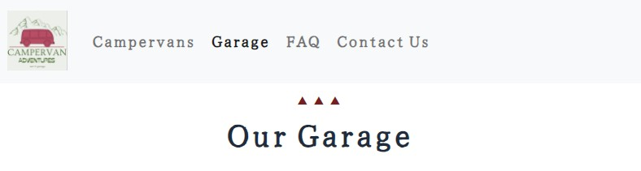
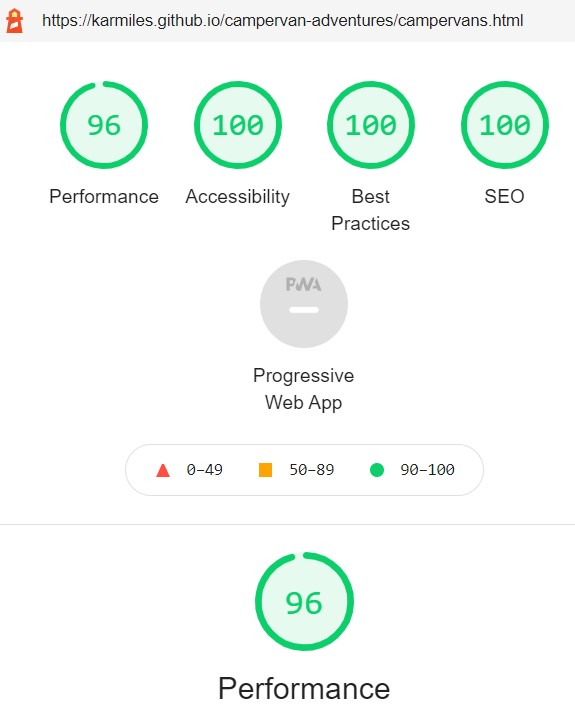

# Campervan Adventures

Developer: Karol Mileszko

[Live webpage](https://karmiles.github.io/campervan-adventures/index.html)

## Table of content

1. [Introduction](#introduction)
2. [Plane 1. Strategy](#plane-1-strategy)
    1. [Project Goals](#project-goals)
    2. [User Experience UX](#user-experience-ux)
        1. [User stories](#user-stories)
        2. [Focus](#focus)
3. [Plane 2. Scope](#plane-2-scope)
    1. [Objective requirements](#objective-requirements)
    2. [Functional specifications](#functional-specifications)
    3. [Content requirements](#content-requirements)
    4. [Project rollout](#project-rollout)
4. [Plane 3. Structure](#plane-3-structure)
    1. [Prioritisation](#prioritisation)
    2. [Semantic sections](#semantic-sections)
5. [Plane 4. Skeleton](#plane-4-skeleton)
6. [Plane 5. Surface](#plane-5-surface)
    1. [Design choices](#design-choices)
    2. [Colour](#colour)
    3. [Fonts](#fonts)
    4. [Structure](#structure)
7. [Technologies used](#technologies-used)
8. [Frameworks Libraries and Programs used](#frameworks-libraries-and-programs-used)
    1. [Tools used](#tools-used)
    2. [Features applied](#features-applied)
        1. [Logo and Navigation bar](#logo-and-navigation-bar)
        2. [Carousel](#carousel)
        3. [Accordion](#accordion)
        4. [Information boxes](#information-boxes)
        5. [Newsletter sign-up form](#newsletter-sign-up-form)
        7. [Map](#map)
        8. [Footer](#footer)
        9. [Error 404 page](#error-404-page)
9. [Deployment](#deployment)
10. [Testing](#testing)
    1. [Validators](#validators)
        1. [W3C Markup Validator](#w3c-markup-validator)
        2. [W3C CSS JigSaw Validator](#w3c-css-jigsaw-validator)
    2. [User Experience UX testing](#user-experience-ux-testing)
        1. [Visibility and functionality](#visibility-and-functionality)
        2. [Accessibility](#accessibility)
        3. [Performance](#performance)
        4. [Browser compatibility](#browser-compatibility)
        5. [Testing user stories](#testing-user-stories)
        6. [Peer review](#peer-review)
11. [Bugs and changes to original design](#bugs-and-changes-to-original-design)
12. [Credits](#credits)
    1. [Code](#code)
    2. [Media](#media)
    3. [Acknowledgements](#acknowledgements)

## Introduction
**The idea for the project**

This webpage is the showcase for a company Campervan Adventures with the intention to encourage anyone considering having a holiday in a campervan to contact them and rent one of their vehicles. Campervan Adventures aims to achieve this goal through giving the visitor the taste of how much fun and beauty holidays in a campervan can provide and presenting some of their campervans in the Campervans section.

**Project preparation**

The Campervan Adventures site was designed using the Five Planes of User Experience approach. This document follows the steps taken during the preparation of the site, going from the most abstract to the most concrete.

# Plane 1 Strategy

## Project Goals
### Owner goals

- Create online presence for Campervan Adventures in order to increase their rental turnover via visitors’ engagement and customer loyalty. 
- Provide customers with means necessary to contact the company.

### User goals
- See how holiday in a campervan can be appealing.
- Contact the company about rental.
- Get more information and inspiration to follow on.
- Check what is needed for campervan holiday.
- See what vehicles are available.
- Rent a vehicle.

## User Experience UX

### User stories

First Time Visitor goals:

1. As a First Time Visitor I want to see what holidays in a campervan look and feel like so that I can decide whether it's appealing to me. **End user goal:** Decide on my  attitude to campervan holidays. **End business goal:** Build prospective customer engagement. **Acceptance criteria:** Present available campervans in an appealing manner. Provide clarification on common questions.

First Time or Returning Visitor Goals:

2. As a Visitor I want to contact Campervan Adventures to enquire about vehicle rental. **End user goal:** Contact the company. **End business goal:** Achieve direct contact with customer to provide service. **Acceptance criteria:** Provide means of contact via telephone, email and visit to the physical address. 
3. As a Visitor I want to subscribe to email newsletter. **End user goal:** Stay in contact for further information and inspiration. **End business goal:** Build and maintain customer loyalty through customer engagement. **Acceptance criteria:** Obtain customer contact information via email and optionally telephone number. 
4. As a  Visitor I want to check  what is needed to have a holiday in a campervan. **End user goal:** Obtain details on what is needed before and during campervan holiday. **End business goal:** Provide customer with clarity about their engagement necessary for satisfying campervan holiday. **Acceptance criteria:** Inform customer about necessities and suggestions related with rental: legal, practical, attitude.
5. As a Visitor I want to see what vehicles are on offer and check for current promotions. **End user goal:** Choose a vehicle. **End business goal:** Provide customer with choice of product leading to rental completion. **Acceptance criteria:** Show pictures and description of vehicles available for rent. 
6. As a Visitor I want to rent a vehicle online. **End user goal:** Finalize rental contract. **End business goal:** Finalize sale of service. **Acceptance criteria:** Update company vehicle database on vehicle availability. Finalize contract and sale via debit/credit card. Receive payment. Provide confirmation on rental and payment.

Site Owner Goals:

7. As the Site Owner I want that prospective clients have multiple ways to engage with the company. **Site Owner goal:** Provide visitors with multiple ways to stay in contact with the company. **End business goal:** Maintain easy flow of communication with clients. **Acceptance criteria:** Site provides Visitors with varied means of communication with the company, including: phone, email, links to company's social media outlets, possibility to sign up for a newsletter, and a possibility to visit in person.

8. As the Site Owner I want that in case a non-existent page is being pulled and an error shows up the negative impact on Visitor's experience is minimized. **Site Owner goal:** Provide Visitors with positive experience even if error occurs. **End business goal:** Maximize revenue and customer retention by maintaining positive relations with customers despite possible technical difficulties. **Acceptance criteria:** Site provides Visitors with positive experience even in case of an error. Error page should be positive and suggest further steps for the Visitor. The Visitor must not be forced to navigate by means outside the company's webpage e.g. through Back button on the browser. 

9. As the Site Owner I want that the Garage which so far had the primary purpose to maintain the company's vehicle fleet, starts to generate additional revenue for the company. **Site Owner goal:** Inform Visitors who own their own vehicles about the garage's services. **End business goal:** Increase revenue by better utilization of the garage crew. **Acceptance criteria:** Site provides Visitors with information on services offered by the garage.

10. As the Site Owner I want that the site is usable on all kinds of widely utilized devices and screens. **Site Owner goal:** Maximize utilisation of the website. **End business goal:** Have maximum reach to wide variety of customers. **Acceptance criteria:** Site presents information and maintains full functionality on wide variety of devices: large computer screens, tablets and smartphones.

### Focus

Assessment of opportunities which should be focused on at the initial roll-out was carried out through the analysis of their importance and viability:

| No. | Opportunity / problem                                                | Importance (1 - 5 most important) | Viability / Feasibility (1– 5 most difficult) | Focus ratio |
| --- | -------------------------------------------------------------------- | --------------------------------- | --------------------------------------------- | ----------- |
| 1   | Create positive image of campervan holidays and Campervan Adventures | 5                                 | 5                                             | 86%         |
| 2   | Ability to contact the company                                       | 5                                 | 5                                             | 86%         |
| 3   | Signing up to the newsletter                                         | 4                                 | 5                                             | 69%         |
| 4   | View company’s rental offer                                          | 5                                 | 4                                             | 69%         |
| 5   | Present company's garage services                                    | 2                                 | 5                                             | 34%         |
| 6   | Rent online                                                          | 4                                 | 1                                             | 14%         |
| 7   | Positive impact despite error                                       | 4                                 | 5                                             | 69%         |

I calculated the Focus ratio by multiplying Importance and Viability and normalised the results. This enabled me to compare every Opportunity on a scale of 0-100%. The higher the number the more crucial it is for the Opportunity to be addressed. Importance and Feasibility spectrum is perfectly illustrated on Code Institute graph below; Opportunities with high factor of both importance and viability would find themselves on the top right corner of the graph (red area). 

    
Importance / Viability graph

    

Basing on the above analysis the initial roll-out follows on opportunities 1 through 5 and 7 as most important and feasible and as such are addressed in the project. 

**Definition**

The "Campervan Adventures" webpage is an online presence for Campervan Adventures company showcasing the attractiveness of campervan holidays and encouraging visitors to contact the company.

**Value**

The value of the project for the owner lies in increased rental turnover achieved through enhanced visitor’s engagement and deepened customer loyalty resulting in repeat orders.
The value for the visitor lies in getting familiar with the world of campervan holidays and getting an opportunity to realize this vision. 

# Plane 2 Scope

## Objective requirements

Visitor wants to find out about spending holidays in a campervan with the possibility of realising this idea.

## Functional specifications

Visitor uses site navigation to find the information presented on the webpage. 

Multiple photographs need to be presented alongside campervan's description.

Visitor can sign up for a newsletter. In order to do it the visitor needs to enter their personal information. 

## Content requirements

Website needs to contain:
* Introduction and pictures representing holidays in a campervan.
* Company’s offer with pictures of vehicles and their description.
* Ability to contact the company via email, social media and telephone.
* Possibility to sign up to a newsletter.
* Presentation of company's services.

## Project rollout

| No. |  Feature                                                              | Difficulty (1 – 3 most difficult) | Release |
| --- | --------------------------------------------------------------------- | --------------------------------- | ------- |
| 1   | Introduction and pictures representing holidays in a campervan        | 1                                 | 1       |
| 2   | Company’s offer with pictures of vehicles and their description       | 2                                 | 1       |
| 3   | Ability to contact the company via email, social media and telephone. | 1                                 | 1       |
| 4   | Possibility to sign up to the newsletter                              | 1                                 | 1       |
| 5   | Presenting company's services                                         | 2                                 | 1       |
| 6   | Online rental                                                         | 3                                 | 2       |
| 7   | Error page                                                            | 1                                 | 1       |

This rollout concentrates on features bringing maximum value to the owner and the user. Those have been identified as features 1 through to 5 and 7.

Feature No. 6 enabling visitors to rent vehicles online finds itself outside the initial rollout due to necessity of employing technologies not included in the project. 

# Plane 3 Structure

## Prioritisation
The information is prioritised in the following order:
1.	Company offer
2.	Contact section
3.	Possibility to sign up for the newsletter.
4.	Presentation of the holidays in a campervan

## Semantic sections
Webpage has three main semantic sections: 

1.	**Navigation bar** at the top of the page is conveniently available to the user at all times and contains links to pages: Home, Campervans, Garage, FAQ and Contact Us.

2.	**Main section** in the middle

    * Landing page - shows a short welcome and description of the company (About Us) and it's offerings (Campervans and Garage).
    
    * Campervans - is the page presenting available campervans with photographs and description of each vehicle. In case more than one photograph is available for a campervan they will be changed by the mouse click using carousel. This part enables visitor to get the feeling which campervan they would be most comfortable in.

    * Garage - shows description of services offered at company's garage.

    * FAQ - presents answers to frequently asked questions related to company's rental and campervan service business.

    * Contact Us - provides contact data (opening hours, address of the company, telephone number and an email address), Google map, newsletter sign-up section.

3.	**Footer** is present at the bottom of each page, with links to company’s social media. Links in the footer open in separate browser windows.

# Plane 4 Skeleton

Site low-fidelity prototypes (wireframes) were created in three versions for various screen sizes: small/smartphone, medium/tablet and large/PC to maintain website responsiveness on various screen sizes:

    
Home

    

    
Campervans

    

    
Garage

    

    
FAQ

    

    
Contact

    

    
404

    

# Plane 5 Surface

## Design choices
The intention behind building the sensory design for the site is focusing on a simple message of beauty lying in campervan holiday. The visitor will be welcomed with a topical pictures of a spacious landscape and of campervans. 

## Colour
Colour palette applied across the site is inspired by the Summer colours of blue sky and hay with addition of amaranth / auburn as a hint of Autumn and vintage styling appropriate to more traditional-style conscious customers loyal to classic Volkswagen campervan heritage.

    
Colour palette

    

## Fonts
Fonts used on the website are 
- Yuji Syuku - for most content, giving the sense of an adventure with a hint of vintage style.
- Allerta Stencil - on boxes listing Garage services and on newsletter form; both referring to traditional post packaging.
- Ovo - on company's logo.
- Stadio Now Display - on company's logo.
## Structure
The website is structured in a familiar, user friendly manner. Navigation on the page is made intuitive thanks to the well-known navigation bar mechanism which turns to the hamburger menu on a small screen. Active element in the navigation bar is marked with darker colour to help visitor in navigation.

Company logo is always visible on top of the page in the navigation section and leads to Home page.

# Technologies used
This project has been realised using the following technologies:
* HTML5
* CSS3
* JavaScript (Bootstrap solutions for responsive navigation and carousel only)

# Frameworks Libraries and Programs used
## Tools used
This project has been realised using the following frameworks, programs and webpages:
* Git - for version control
* [GitHub](https://github.com/) - for storing the project's code and other files
* [Visual Studio Code](https://code.visualstudio.com/) - for writing the code and documents
* [Balsamiq](https://balsamiq.com/) - for wireframes creation
* [Bootstrap](https://getbootstrap.com/) - for navigation and image manipulation components
* [Google Fonts](https://fonts.google.com/)
* [Table to Markdown](https://tabletomarkdown.com) - for converting tables to markdown format.
* [Awkale GitHub repository](https://github.com/awkale/user-story-best-practice/blob/master/README.md) - User Story Best Practice documentation and presentation
* [W3 School](https://www.w3schools.com/) - for HTML and CSS coding solutions
* [C#Corner](https://www.c-sharpcorner.com/blogs/accordion-using-html-5) - for tutorial on HTML5-based accordion
* [IrfanView](https://www.irfanview.com/) - for graphics editing

## Features applied
Site consists of five pages with following features:

### Logo and Navigation bar
- Visible on all pages.
- Navigation bar is fully responsive to screen size and may be visible in full or switches to a togbar on small screens.
- Company logo serves as Home page link and is visible on all screen sizes.
- Active link is highlighted for easier navigation.

    
 Screenshot 

    
    

### Carousel
- One carousel is dedicated to each campervan on Campervans page and shows photographs depicting the outside and inside of the vehicle in a possibly appealing manner. 
- User stories covered: 1, 5.

    
 Screenshot 

    

### Accordion
- Accordion utilizes the disclosure summary element.
- Easy and intuitive method for presenting considerable amount of information in an orderly fashion. This allows to clarify most common questions.
- User stories covered: 1, 4.

    
 Screenshot 

    

### Information boxes
- Information boxes allowing clear and concise presentation of information on services offered by company's garage.
- Depending on screen size boxes are presented horizontally or vertically.
- User stories covered: 5, 9.

    
 Screenshot 

    
    

### Newsletter sign-up form
- Sign up form checks input for correctness and lets visitor indicate their interest (rent or garage services)
- Provides site owner with means to maintain customer engagement.
- User stories covered: 3, 7.

    
 Screenshot 

    

### Map
- Shows company's location and provides convenient way to get directions. As an alternative a link to Google Maps with the same location is provided.
- User stories covered: 2, 7.

    
 Screenshot 

    

### Footer
- Is present at the bottom of every page.
- Provides links to company's social media platforms. 
- User stories covered: 1, 2, 7.

    
 Screenshot 

    

### Error 404 page
- Communicates short message about error and presents the visitor with the option to click a link leading to Home page. The visitor is also presented with possibility to chose other means of contact, as on Contact page.

User story covered: 8.

    
 Screenshot 

    

# Deployment
The site is deployed to GitHub pages, using also GitHub repository, GitHub clone and GitHub branch methods as needed. On local computer Visual Studio Code program was used.

GitHub deployment:
1. After logging in to GitHub go to chosen GitHub repository (GitHub Repository for this project: https://github.com/KarMiles/campervan-adventures),
2. Go to Settings (top right),
3. Select Pages (menu on the left),
4. In Source section select Branch: main,
5. After the page refreshes automatically the confirmation appears (in case of this project: Your site is published at https://karmiles.github.io/campervan-adventures/).

Repository may be forked in the following steps:
1. Go to GitHub repository,
2. Click Fork button (top right).

Steps for cloning repository:
1. Go to GitHub repository,
2. Click Code button (top right above files list),
3. Select cloning method option: HTTPS, SSH or GitHub CLI and click Copy button (right side of the text box) to copy URL to clipboard,
4. Open Git Bash (Git Bash can be downloaded from https://git-scm.com/downloads),
5. In Git Bash change working directory to the desired destination for the clone,
6. Type "git clone", paste URL for SSH method from the clipboard (in this project: git clone git&#8203;@github.com:KarMiles/campervan-adventures.git) and press Enter.

# Testing
## Validators

The following validators were used for testing code correctness:
### W3C Markup Validator 

No errors or warnings were found by [W3C Markup Validator](https://validator.w3.org/)  throughout the site.

    
Home

    

    
Campervans

    

    
Garage

    

    
FAQ

    

    
Contact

    

    
404

    

### W3C CSS Jigsaw Validator

No errors were found by [W3C CSS Jigsaw Validator](https://jigsaw.w3.org/css-validator). Reported warnings are related to Bootstrap and Font Owesome solutions.

    
CSS Validation

    

    
Bootstrap

    

    
Font Owesome

    

## User Experience UX testing

### Visibility and functionality
Optimal visibility and functionality on various devices was tested throughout the production process and the finished product was tested using [Responsive Designs](http://ami.responsivedesign.is). Screen from this test is placed in the beginning of this document.

### Accessibility
Testing for accessibility of the site was carried out with the employment of [WAVE Web Accessibility Evaluation Tool](https://wave.webaim.org/). No errors were found. Alerts were addressed where needed.

    
Home

    

    Web accessibility alerts indicated a repeated links. These are important for optimal user experience in this case.

    
Campervans

    

    Alerts related to Campervans page indicated to repeated alternative texts in carousel. This is due to similar nature of images in the carousel.

    
Garage

    

    
FAQ

    

    
Contact

    

    
404

    

### Performance
Performance testing was done in [Lighthouse](https://developers.google.com/web/tools/lighthouse), part of the Google Chrome Developer Tools.
 All performance tests ended with score between 90-100.

    
Home

    

    
Campervans

    

    
Garage

    

    
FAQ

    

    
Contact

    

    
404

    

### Browser compatibility
The website was tested on browsers:
- Google Chrome
- Microsoft Edge
- Mozilla Firefox
- Opera

### Testing user stories
1.	As a First Time Visitor I want to see what holidays in a campervan look and feel like so that I can decide whether it's appealing to me. 

| Feature                                     | Action                                                               | Expected result                                     | Actual result |
| ------------------------------------------- | -------------------------------------------------------------------- | --------------------------------------------------- | ------------- |
| Carousel with pictures of campervans.       | Navigate to Campervans page, go through images.                      | See campervans with their important features shown. | As expected.  |
| Description of campervans.                  | Navigate to Campervans page, read descriptions.                      | Get accustomed with campervan features available.   | As expected.  |
| Accordion with answers to common questions. | Navigate to FAQ page, scroll through questions, read chosen answers. | Get clarification on common questions.              | As expected.  |

    
 Screenshots 

    
    
    
    
    

2. As a Visitor I want to contact Campervan Adventures to enquire about vehicle rental. 

| Feature                          | Action                                                                                | Expected result                                | Actual result |
| -------------------------------- | ------------------------------------------------------------------------------------- | ---------------------------------------------- | ------------- |
| Contact details on Contact page. | Navigate to Contact page and choose means of contact.                                 | Means of contact provided.                     | As expected.  |
| Google Maps directions.          | Navigate to Contact page and click on link to Google Maps or on map provided on page. | Get directions to company’s physical location. | As expected.  |

    
 Screenshots 

    
    

3.	As a Visitor I want to subscribe to email newsletter. 

| Feature          | Action                                                         | Expected result      | Actual result               |
| ---------------- | -------------------------------------------------------------- | -------------------- | --------------------------- |
| Newsletter form. | Navigate to Contact page, fill the Newsletter form and submit. | Enrol to newsletter. | As expected (in demo mode). |

    
 Screenshots 

    

4.	As a Visitor I want to check what is needed to have a holiday in a campervan. 

| Feature                                      | Action                                                               | Expected result    | Actual result |
| -------------------------------------------- | -------------------------------------------------------------------- | ------------------ | ------------- |
| Accordion with answers to related questions. | Navigate to FAQ page, scroll through questions, read chosen answers. | Get clarification. | As expected.  |

    
 Screenshots 

    

5.	As a Visitor I want to see what vehicles are available for rent and check for company's current offer.

| Feature                                                              | Action                                                                                              | Expected result                                    | Actual result |
| -------------------------------------------------------------------- | --------------------------------------------------------------------------------------------------- | -------------------------------------------------- | ------------- |
| Carousel with campervans photos and campervan descriptions.          | Navigate to Campervan page, see photographs and read descriptions of campervans available for rent. | Get accustomed with campervans and their features. | As expected.  |
| List of services available for campervan owners at company’s garage. | Navigate to Garage page, see services available.                                                    | Get accustomed with company’s services.            | As expected.  |

    
 Screenshots 

    
    
    
    

6. As a Visitor I want to rent a vehicle online. User story not realized in initial release as described in the analysis in the [Focus](#focus) section.

7. As the Site Owner I want that prospective clients have multiple ways to engage with the company. 

| Feature                          | Action                                                                                | Expected result                                              | Actual result               |
| -------------------------------- | ------------------------------------------------------------------------------------- | ------------------------------------------------------------ | --------------------------- |
| Contact details on Contact page. | Navigate to Contact page and choose means of contact.                                 | Means of contact provided.                                   | As expected.                |
| Google Maps directions.          | Navigate to Contact page and click on link to Google Maps or on map provided on page. | Get directions to company’s physical location.               | As expected.                |
| Newsletter form.                 | Navigate to Contact page, fill the Newsletter form and submit.                        | Enrol to newsletter.                                         | As expected (in demo mode). |
| Footer                           | At the bottom of the page click on chosen social media link.                          | Opens new window or tab with company’s social media profile. | As expected.                |

8.	As the Site Owner I want that in case a non-existent page is being pulled the negative impact on Visitor's experience is minimized. 

| Feature         | Action                                                         | Expected result                                                                           | Actual result |
| --------------- | -------------------------------------------------------------- | ----------------------------------------------------------------------------------------- | ------------- |
| Error 404 page. | When a non-existent page is called the Error 404 page appears. | In case of error the Error 404 page appears with a short message and a link to main page. | As expected.  |

    
 Screenshots 

    

9.	As the Site Owner I want that the Garage starts to generate additional revenue for the company. 

| Feature    | Action                                          | Expected result                                              | Actual result |
| ---------- | ----------------------------------------------- | ------------------------------------------------------------ | ------------- |
| Info-boxes | Navigate to Garage page to read about services. | Information about services provided by the garage presented. | As expected.  |

    
 Screenshots 

    

10.	As the Site Owner I want that the site is usable on all kinds of widely utilized devices and screens. 

| Feature                                               | Action                                                                                                                    | Expected result                                                                                     | Actual result |
| ----------------------------------------------------- | ------------------------------------------------------------------------------------------------------------------------- | --------------------------------------------------------------------------------------------------- | ------------- |
| Application of responsive design throughout the site. | Site checked for responsiveness on wide range of screens, internet browsers and for performance in performance validator. | All features adjust and maintain full functionality on wide range of screens, browsers and devices. | As expected.  |

### Peer review
Peer code review at Slack (#peer-code-review).

# Bugs and changes to original design
During realisation of the project the following obstacles were met and changes to original design introduced:
* Footer behaving differently on different pages. Fixed position was covering other content. On Campervans page when on static property footer was not spreading across width of page. Solution: default position on all pages. On Campervans page I added property clear with value both. 
* Content on Contact page slightly rearranged compared to wireframe for better visibility; map visible on most of the screen.
* Presentation of information changed on Garage page; as navigation bar component would be very similar to main navigation bar I decided on a different solution: divided content into boxes, adhering to responsive design practice.
* Navigation bar left in default left-align as functional and aesthetically pleasing. 
* Columns not performing correctly on Mozilla Firefox browser. Firefox-specific fix applied in style.css addressed the problem.

# Credits
## Code

Code for responsive [Navigation bar](https://getbootstrap.com/docs/5.1/components/navbar/) and [Carousel](https://getbootstrap.com/docs/5.1/components/carousel/) were sourced from Bootstrap v5.1 library. 
## Media

[Canva](www.canva.com) – logo creation

    
campervan-adventures-logo

    

[Colormind](http://colormind.io) – color palette creation  

    
colour palette creation

    

[Font Awesome](https://fontawesome.com/) - sourcing icons

[Pikwizard](https://pikwizard.com/) - stock photographs

- [about-us](assets/images/about-us.jpg)  photo by [People Creations](https://pikwizard.com/photo/group-of-friends-having-fun-together-near-campervan/74ff984b09ddc5ed6e3e646752370ccf)
- [campervan-b-01](assets/images/gallery/campervan-b-01.jpg)  photo by [People Creations](https://pikwizard.com/photo/group-of-friends-having-fun-together-near-campervan/74ff984b09ddc5ed6e3e646752370ccf)
- [campervan-b-01](assets/images/gallery/campervan-b-02.jpg)  photo by [Awesome Content](https://pikwizard.com/photo/group-of-friends-having-fun-at-music-festival/e0ac53025abc7fd718d2a0e04444f6a1)
- [campervan-b-03](assets/images/gallery/campervan-b-01.jpg)  photo by [People Creations](https://pikwizard.com/photo/woman-looking-out-of-campervan-window/b1fb1057c83a8f7c75ab2c548070910c)
- [garage-mechanic](assets/images/garage-mechanic.jpg) photo by [People Creations](https://pikwizard.com/photo/female-mechanic-repairing-a-car/f9c630d5598c1aad0832fc8998a6ac8b)
- [garage](assets/images/garage.jpg) photo by [People Creations](https://pikwizard.com/photo/car-parts-in-repair-garage/5bce5f680d1e26a60b81565e0f9d7144)
- [road-landscape](assets/images/road-landscape.jpg) licence [CC0 (Creative Commons Zero)](https://pikwizard.com/photo/asphalt-road-landscape/6ea9c654aa20453193b93eba137134f1)
- [welcome-landscape](assets/images/welcome-landscape.jpg) licence [CC0 (Creative Commons Zero)](https://pikwizard.com/photo/asphalt-road-landscape/6ea9c654aa20453193b93eba137134f1)
- [writing](assets/images/writing.jpg) licence [CC0 (Creative Commons Zero)](https://pikwizard.com/photo/writing-drawing-homework/e73d37b1f5d32eb011fec645b0f0281c)

[Unsplash](https://unsplash.com) - stock photographs
- [campervan-b-03](assets/images/gallery/campervan-b-01.jpg)  photo by [Manuel Meurisse](https://unsplash.com/@manuelmeurisse)
- [campervans](assets\images\campervans.jpg) photo by [Jamie Street](https://unsplash.com/@jamie452)
- [compass](assets/images/compass.jpg) photo by [Aaron Burden](https://unsplash.com/@aaronburden)
- [faq](assets/images/faq.jpg) photo by [Denise Jans](https://unsplash.com/@dmjdenise)

[Code Institute](https://learn.codeinstitute.net/) - educational material

    
 feasibility-graph 

    

Other media are property of the developer.

## Acknowledgements
I would like to thank everyone who contributed to development of this project, especially:
- My mentor Mo Shami for his invaluable guidance and advice.
- Educational Team at [Code Institute](https://codeinstitute.net/) for all educational materials which made this project possible.
- All visual artists and coders who make products of their work available to others online.